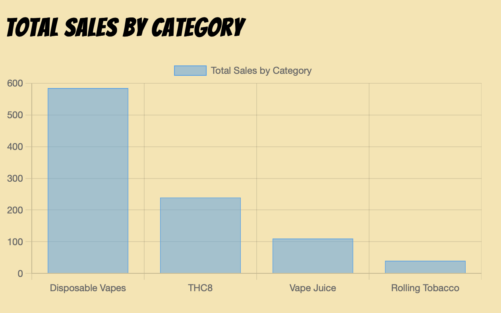
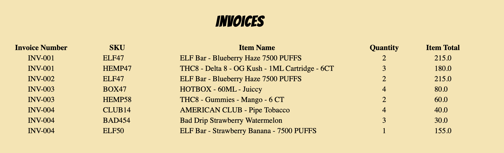
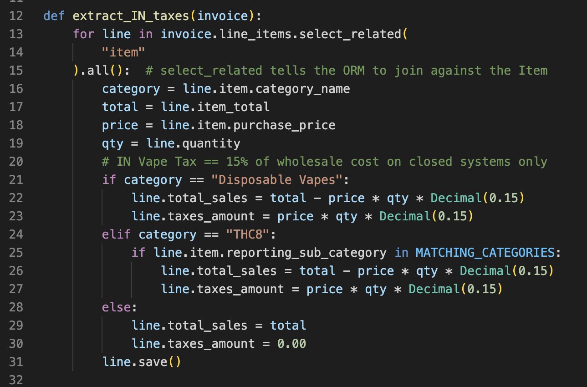

# Kung Fu Vapes Data Cloud
> Simple full-stack analytics app for a B2B company created with Django and Chart.js.
> Live demo [_here_](http://ianahill.pythonanywhere.com). 
## Table of Contents
* [General Info](#general-information)
* [Technologies Used](#technologies-used)
* [Features](#features)
* [Screenshots](#screenshots)
* [Setup](#setup)
* [Usage](#usage)
* [Future Development](#future-development)
* [Acknowledgements](#acknowledgements)
* [Contact](#contact)


## General Information
Kung Fu Vapes Data Cloud is a full-stack web application created with Django for the purposes of Data Analytics for a Business to Business distribution company. It is based on a real-world startup company that was building out its analytics department (the name and branding have been changed). It uses an SQLite database for the purposes of generating up-to-date interdepartmental dashboards that are fully automated.

A typical users would be a Data Analyst who would create data visualizations or dashboards using technologies like Chart.js, Matplotlib, Plotly, or embedded Power BI or Tableau dashboards that connect to the database for automation. It would also be regularly accessed by executive management or department heads to view dashboards and reports pertinent to their department or roles. Django allows easy user authentication and user specific views to allow the Data Analyst to control who can view what data, and to provide only relevant views to each user.

Rather than having to recreate reports and dashboards manually, pulling datasets each time, the Kung Fu Vapes Data Cloud allows the Analyst to focus on refining and developing further dashboards. Whether the database is updated by connecting to a third-party API or by importing CSV files, the front-end reports are automatically updated.


## Technologies Used
- Django - version 4.1.5
- ipython - version 8.8.0
- django-extensions - version 3.2.1
- django-click - version 2.3.0
- pytest - version7.2.1
- Chart.js - version 4.0


## Features
Some of the core functionality of this app includes:
- Easily update the database by importing CSV files directly via the command line
- The Django ORM makes it simple to access data through view context to aggregate data and display visuals - no Pandas required
- The front-end is a blank canvas that analysts can use to connect any dashboard technologies of their choice to the database
- Use Django user authentication to create custom views for each user -- have an executive dashboard when the CEO logs in, or an HR dashboard for HR, etc.
- Data visualizations are fully automated. When the database updates, so do the dashboards!
- Custom functions provide useful data transformations that the source doesn't. `taxes.py`, for example, automatically extracts complicated excise taxes from invoices based on state and product and stores the values in separate fields for easy tax reporting.


## Screenshots
<figure>

<figcaption>An example sales summary aggregation by item category</figcaption>
</figure>
<figure>

<figcaption>A table dynamically filled with data from the database, demonstrating basic CRUD functionality</figcaption>
</figure>
<figure>

<figcaption>An example of a custom tax extraction data manipulation function</figcaption>
</figure>


## Setup
After cloning the repository and setting up your virtual environment, you will need to install the depencies for this project. They are included in the `requirements.txt` file. Simply run the following on the command line:
```shell
$ pip install -r requirements.txt
```


## Usage
Once you have set up your virtual environment and installed the dependencies, you are ready to use the app! Data is easy to import using the custom ``import_csv.py`` function. Simply run the following command in the terminal:

```shell
$ python manage.py import_csv exampleData.csv
```
where exampleData.csv is the file name and path for the csv you are trying to import. Sample CSV datasets are included in this project's root folder.

You will be prompted to enter Invoices, Customers, or Items, corresponding to which table in the database you are loading the data.


## Future Development
There is a lot of potential to showcase a variety of dashboards and data visualization technologies on the front-end. The immediate next step for this project is to include a variety of users to login with custom homepages displaying different dashboards for each user.

Room for improvement:
- Improve unit testing on custom functions (i.e. taxes.py)
- Add mobile responsive design to the front end
- Add more data visuzlizations and full dashboards with more detail
To do:
- Write a function to update the database with a call to a third-party API (this project is based on a company that used Zoho Inventory)
- Custom dashboards for different users


## Acknowledgements
Many thanks to
- Jen Kerkado at The Career Force for her empowering coaching and thorough expertise of the world of Data Science
- RevSys and particularly Frank Wiles for his unparalleled insight and understanding of Django
- Joe Han through the Rutgers full-stack coding bootcamp for always encouraging me to "just google" things and persevere in finding solutions


## Contact
Created by [@ianahill](https://www.ianahill.com/) - feel free to contact me!
